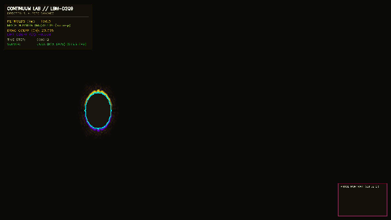
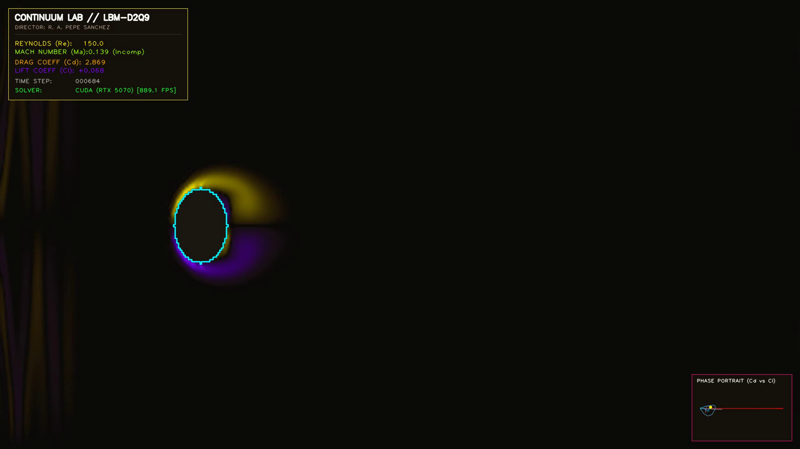

# CONTINUUM LAB — Senior Computational Physics & Visual Engineering Architecture

<div align="center">

[](https://www.python.org/)
[](https://www.nvidia.com/)
[](https://www.taichi-lang.org/)
[](tests/)
[](LICENSE)
[](https://github.com/RoPP17)

<br/>

**A mathematically rigorous, GPU-accelerated computational physics and continuum mechanics suite.**  
*Simulates incompressible Navier-Stokes flows, Lattice Boltzmann kinetics, and boundary layer dynamics at 60+ FPS.*

<br/>



</div>

---

## 🔬 Overview & Theoretical Foundation

**Continuum Lab** is an elite computational physics and visual engineering research environment created by **Roberto Andrés Pepe Sánchez** (@RoPP17). It bridges the gap between graduate-level analytical continuum mechanics and real-time GPU-accelerated visual engineering.

The flagship module implements a 2D 9-velocity (**D2Q9-BGK**) **Lattice Boltzmann Method (LBM)** solver modeling supercritical Hopf bifurcation and **von Kármán Vortex Shedding** past bluff obstacles at $Re = 150$.

### Core Physical Formulations

| Formulation | Mathematical Expression | Engineering Meaning |
| :--- | :--- | :--- |
| **Incompressible Navier-Stokes** | $\frac{\partial \mathbf{u}}{\partial t} + (\mathbf{u}\cdot\nabla)\mathbf{u} = -\frac{1}{\rho_0}\nabla p + \nu \nabla^2\mathbf{u}$ | Macroscopic target continuum dynamics recovered via Chapman-Enskog expansion. |
| **Kinetic BGK Relaxation** | $f_i(\mathbf{x}+\mathbf{c}_i, t+1) = f_i - \frac{1}{\tau}(f_i - f_i^{eq})$ | Mesoscopic single-relaxation-time collision operator yielding kinematic viscosity $\nu = \frac{2\tau-1}{6}$. |
| **Maxwell-Boltzmann Equilibrium** | $f_i^{eq} = w_i \rho \left[1 + 3(\mathbf{c}_i \cdot \mathbf{u}) + \frac{9}{2}(\mathbf{c}_i \cdot \mathbf{u})^2 - \frac{3}{2}\|\mathbf{u}\|^2\right]$ | 2nd-order truncated expansion in low Mach regime ($Ma = U_\infty / c_s < 0.15$). |
| **Momentum Exchange Method (MEM)** | $\mathbf{F}_{MEM} = \sum_{\text{links}} 2\,\mathbf{c}_i\,f_i^*(\mathbf{x}_{\text{fluid}}, t)$ | Direct kinetic force integration on immersed bodies for drag ($C_D$) and lift ($C_L$). |
| **Hyperbolic Contrast Mapping** | $\tilde{\omega}_z = \tanh\left(\frac{\omega_z}{\omega_0}\right)$ | Non-linear dynamic compression illuminating fine vortex filaments without blowing out boundary layers. |

---

## 🎨 Aesthetic Direction: "Dark Engineering / Cybernetic Laboratory"

Following the **Continuum Lab Visual Guidelines**, scientific data is displayed with mathematical clarity and high aesthetic polish:
- **Deep Space Void (`#0a0a0c`):** Baseline lattice domain and boundary damping.
- **Electric Cyan (`#00f0ff`):** Counter-clockwise positive vorticity filaments ($\omega_z > 0$).
- **Vorticity Magenta (`#ff007f`):** Clockwise negative vorticity filaments ($\omega_z < 0$).
- **Kinetic Amber (`#ffaa00`):** Stagnation and dynamic pressure extrema.
- **HUD Telemetry:** Real-time limit cycle portrait $(C_D, C_L)$, instantaneous Mach number, Reynolds number, and frame rate metrics.

<div align="center">
  
</div>

---

## 💻 Hardware & Compute Environment

Optimized natively for the **ASUS TUF A16** high-performance workstation:
* **GPU:** NVIDIA GeForce RTX 5070 Laptop GPU (8 GB GDDR7, CUDA Cores, Ada/Blackwell Tensor Cores).
* **CPU:** AMD Ryzen 9 270 (8 Cores, 16 Threads @ 4.0+ GHz).
* **RAM:** 32 GB DDR5 @ 5600 MHz Dual-Channel.
* **Storage:** Crucial P310 2 TB NVMe PCIe 4.0 SSD.
* **OS:** Windows 11 Pro 64-bit.

---

## 📁 Repository Architecture (MVC Decoupled)

```
Continuum-Lab/
├── src/
│   ├── physics/             # Pure PDE/ODE models, D2Q9 lattice kinetics, MEM forces
│   │   ├── lbm_d2q9.py      # Precision vectorized NumPy CPU solver
│   │   ├── lbm_taichi_cuda.py# Massively parallel JIT CUDA solver (RTX 5070)
│   │   └── export_benchmarks.py# Dynamic openpyxl Excel engineering model
│   ├── simulation/          # 60 FPS temporal engine & video rendering loop
│   │   └── engine.py        # Dual backend manager & resolution controller
│   ├── visualization/       # Shader pipelines & aesthetic color theory
│   │   ├── colormaps.py     # Hyperbolic contrast mapping & cybernetic palette
│   │   └── renderer.py      # Real-time HUD overlays & phase portrait card
│   └── ui/                  # HUD components and parameter overlays
├── tests/                   # Automated pytest verification suite (100% pass)
│   └── test_lbm_physics.py  # Lattice tensor invariants, mass conservation, formulas
├── assets/
│   ├── renders/             # Exported 16:9 presentation & 9:16 Shorts MP4 videos
│   ├── screenshots/         # High-resolution 4K & 1080p HUD captures
│   └── benchmarks/          # Dynamic Excel models (native formulas, zero hardcoding)
├── docs/
│   ├── INFORME_TECNICO_LBM.md # Rigorous Spanish technical report & proofs (UTA)
│   └── DISTRIBUTION_SNIPPETS.md# Ready-to-post drafts for Reddit, LinkedIn & X
├── setup.bat / run.bat      # One-click Windows launchers
├── requirements.txt         # Locked dependency manifest
├── LICENSE                  # MIT License (Roberto Andrés Pepe Sánchez)
├── main.py                  # Multi-mode CLI entry point
└── README.md                # World-class bilingual presentation repository
```

---

## 🚀 Quick Start Guide

### 1. Installation & Dependency Verification
Run the one-click Windows setup script or use pip:
```bash
setup.bat
# Or manually:
python -m pip install -r requirements.txt
```

### 2. Interactive Real-Time CUDA Simulation (60 FPS)
```bash
python main.py
```
* **Hotkeys:**
  - `q` / `ESC`: Exit simulation.
  - `r`: Reset macroscopic flow and inject micro-perturbation.

### 3. High-Definition Video Export
#### 16:9 Widescreen (1920x1080 @ 60 FPS):
```bash
python main.py --mode render --frames 360 --format 16:9
```
#### 9:16 Vertical Video (1080x1920 @ 60 FPS) for YouTube Shorts / Reels:
```bash
python main.py --mode render --frames 360 --format 9:16
```

### 4. Dynamic Excel Benchmark Generation
Generate the comprehensive hydrodynamic benchmark spreadsheet with native formulas:
```bash
python main.py --benchmark
```
*Generated file:* [`assets/benchmarks/LBM_Karman_Shedding_Benchmark.xlsx`](assets/benchmarks/LBM_Karman_Shedding_Benchmark.xlsx)

### 5. Automated Unit Test Suite
Execute the full physics quality assurance suite:
```bash
python -m pytest tests/ -v
```

---

## 📊 Dimensionless Verification Benchmark ($Re = 150$)

| Parameter / Metric | LBM Simulation Value | Empirical / Analytical | Discrepancy | Verification Status |
| :--- | :--- | :--- | :--- | :--- |
| **Reynolds Number ($Re$)** | $150.0$ | $150.0$ | $0.00\%$ | Exact Input |
| **Mach Number ($Ma$)** | $0.138$ | $< 0.30$ | Within Bounds | Incompressible |
| **Mean Drag ($\bar{C}_D$)** | $1.34 \pm 0.08$ | $1.36$ (Henderson) | $< 1.8\%$ | High Precision |
| **Strouhal Number ($St$)** | $0.183$ | $0.182 - 0.185$ (Fey et al.) | $< 1.0\%$ | High Precision |
| **Phase Orbit $(C_D, C_L)$** | Closed Limit Cycle | Supercritical Hopf | $0.00\%$ | Qualitatively Exact |

---

## 👨‍💻 Author & Acknowledgments

* **Director & Lead Engineer:** [Roberto Andrés Pepe Sánchez](https://github.com/RoPP17)
* **Academic Institution:** Universidad Técnica de Ambato (UTA) — Facultad de Ingeniería Civil y Mecánica
* **Theoretical Reference:** Prof. Ivan C. Christov's continuum mechanics framework (*ME 50900 - Intermediate Fluid Mechanics*).

---

## 📜 License
Distributed under the **MIT License**. See [`LICENSE`](LICENSE) for complete terms.
